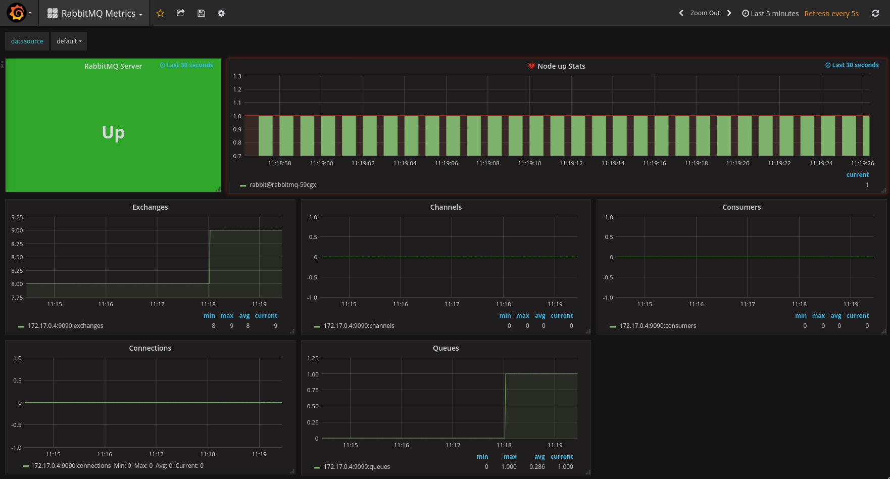
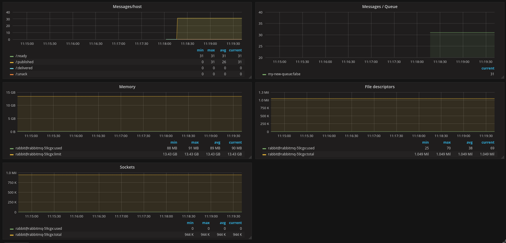

# Prometheus / Grafana Example Setup on OpenShift

Prometheus is tech preview on OpenShift 3.7. Product documentation is here - https://docs.openshift.com/container-platform/3.7/install_config/cluster_metrics.html#openshift-prometheus

The main prometheus image from the redhat registry is currently based on Prometheus 2.0.0 - https://access.redhat.com/containers/?tab=security#/registry.access.redhat.com/openshift3/prometheus/images/v3.7.14-5

The origin documentation gives more details on installation - for example as a standalone prometheus instance - https://github.com/openshift/origin/tree/master/examples/prometheus

This repository contains OpenShift template copies (some with slight modfiications as noted) so the install can be run offline if required.

We end up with a - Grafana + Wizzy + Promtheus + Node Exporter design.

### Prometheus for Cluster/Operations Setup

Prometheus can be installed into an OpenShift cluster using an ansible playbook as per the OpenShift product documentation. It consists of:

- Prometheus
- Alertmanager
- Alert Buffer
- OAuth proxy

To install promethus as a `StatefulSet` manually using the the CLI we can use the RedHat provided templates.

Create a working folder:

```
mkdir prometheus-grafana && cd prometheus-grafana
```

Grab a copy of the prometheus template (this is the latest origin template version). They are stored here at present - https://github.com/openshift/origin/tree/master/examples/prometheus

```
wget https://raw.githubusercontent.com/openshift/origin/master/examples/prometheus/prometheus.yaml -O  prometheus-ops.yaml

OR from this repo:

./prometheus-ops.yaml
```

`Hack Note:` the [`prometheus-ops.yaml`](https://raw.githubusercontent.com/eformat/prometheus-grafana/master/prometheus-ops.yaml) version checked in to this git repo contains modification to ignore OAUTH configuration:
```
          - -skip-auth-regex=/
          - -ssl-insecure-skip-verify=true
```
Use these mods only in a lab type environment if you cannot login using the OpenShift OAUTH provider as setup in the template (there seemed to be issues with OAUTH and self signed certificates when i tried this)

Create a new project for prometheus (the default is kube-system)

```
oc new-project prometheus-ops --display-name='Prometheus OPS' --description='Prometheus OPS'
```

`Note:` ensure you don't have any node selectors on the project you are installing into for the StatefulSet e.g. for defualt kube-system
```
oc annotate ns kube-system openshift.io/node-selector= --overwrite
```

Create prometheus StatefulSet using upstream images as defined in the template (ephemeral)

```
oc new-app -f prometheus-ops.yaml -p NAMESPACE=$(oc project -q)
```

Or use the official tech preview images (ephemeral)

```
oc new-app -f prometheus-ops.yaml \
  -p NAMESPACE=$(oc project -q) \
  -p IMAGE_PROXY=registry.access.redhat.com/openshift3/oauth-proxy:v3.7.14-5 \
  -p IMAGE_PROMETHEUS=registry.access.redhat.com/openshift3/prometheus:v3.7.14-5 \
  -p IMAGE_ALERTMANAGER=registry.access.redhat.com/openshift3/prometheus-alertmanager:v3.7.14-5 \
  -p IMAGE_ALERT_BUFFER=registry.access.redhat.com/openshift3/prometheus-alert-buffer:v3.7.14-5
```

(Optional) The node-exporter component can be installed as a daemon set to gather basic host level metrics. It requires additional privileges to view the host and should only be run in administrator controlled namespaces. The `openshift/prometheus-node-exporter:v0.14.0` image is in OpenShift origin only at present:

```
wget https://raw.githubusercontent.com/openshift/origin/master/examples/prometheus/node-exporter.yaml

OR from this repo:

./node-exporter.yaml

oc create -f node-exporter.yaml
oc adm policy add-scc-to-user -z prometheus-node-exporter hostaccess
```

`Notes on Storage:` The ansible playbooks that come with OpenShift 3.7 allow the configuration of PV's for each component - see: https://docs.openshift.com/container-platform/3.7/install_config/cluster_metrics.html#openshift-prometheus-config. The standalone templates are ephemeral at present.

Test with some prometheus sample queries from: https://github.com/openshift/origin/tree/master/examples/prometheus

```
-- CPU consumed per node in the cluster.
sort_desc(sum by (kubernetes_io_hostname,type) (rate(container_cpu_usage_seconds_total{id="/"}[5m])))

-- Number of mutating API requests being made to the control plane.
sort_desc(sum without (instance,type,code) (rate(apiserver_request_count{verb=~"POST|PUT|DELETE|PATCH"}[5m])))

-- Returns the number of failed builds, regardless of the failure reason.
sum(openshift_build_total{phase="Failed"})
```

Delete Prometheus

```
oc delete project prometheus-ops
oc delete clusterrolebinding prometheus-cluster-reader
```

### Prometheus Standalone

Creates a Prometheus instance without any configuration, intended for use when you have your own configuration. We will use a simple application example.

`Hack Note:` the [`prometheus-standalone.yaml`](https://raw.githubusercontent.com/eformat/prometheus-grafana/master/prometheus-standalone.yaml) version checked in to this git repo contains modification to ignore OAUTH configuration:
```
          - -skip-auth-regex=/
          - -ssl-insecure-skip-verify=true
```
Use this only in a lab type environment if you cannot login using the OpenShift OAUTH provider as setup in the template (these seemed to have issues with OAUTH and self signed certificates when i tried this)

We need to create two secrets containg the prometheus and alertmanager configuration files.

We are going to modify the first configuration to collect from our test application (rabbitmq namespace only). Prometheus will scrape from services and pods with the `prometheus.io annotations` set (see prometheus config file for details).

```
-- Get a default prometheus global config
wget https://raw.githubusercontent.com/prometheus/prometheus/master/documentation/examples/prometheus.yml -O prometheus.yml

-- OR use the version in this repo: 

./prometheus.yml

```
And for alertmanager (this is not configured yet)
```
-- Get a default prometheus altermanager config (not configured for now)
wget https://raw.githubusercontent.com/prometheus/alertmanager/master/doc/examples/simple.yml -O alertmanager.yml

// edit
// commented out hipchat which errors for now

-- OR use the version in this repo:
./alertmanager.yml
```

Create a project (`prometheus.yaml` config references this name `rabbitmq` so change the config if you use a different name)

```
oc new-project rabbitmq --display-name='RabbitMQ' --description='RabbitMQ'
```

Create our prometheus secrets:

```
oc create secret generic prom --from-file=./prometheus.yml
oc create secret generic prom-alerts --from-file=./alertmanager.yml
```

Create the standalone prometheus instance in our namespace:

```
oc process -f prometheus-standalone.yaml | oc apply -f -
```

Allow the `prom` service account to view our namespace

```
oc policy add-role-to-user view system:serviceaccount:$(oc project -q):prom
```

### RabbitMQ Application Example using Standalone Prometheus

I used the simple example from the Prometheus example repository: https://github.com/prometheus/prometheus/tree/master/documentation/examples/kubernetes-rabbitmq

This meant an easier route to monitoring / exporting and graphing MQ stats.

There are many others. For example a clustered RabbitMQ can be found here: https://github.com/redhat-cop/containers-quickstarts/tree/master/rabbitmq

To create a rabbitmq pod using files in this repo:

```
oc create -f ./rabbitmq-rc.yaml
oc create -f ./rabbitmq-svc.yaml
oc expose svc rabbitmq
```

Prometheus endpoints for the application available here: http://rabbitmq-rabbitmq.127.0.0.1.xip.io/metrics

We are using RabitMQ Prometheus Exporter/Integration listed on the promehteus website: https://prometheus.io/docs/instrumenting/exporters/

The ReplicationController has one pod with two containers:
- rabbitmq:3.7.2-management-alpine (see https://hub.docker.com/_/rabbitmq/)
- kbudde/rabbitmq-exporter:latest (exports rabbitmq metrics see https://github.com/kbudde/rabbitmq_exporter)

You should now be able to see rabbitmq scraped data in prometheus.

### Grafana Dashboarding

Grafana dashboard is not yet part of OpenShift and is a work in progress. There has been recent work to include grafana as an example in upstream origin. We can make use of this example work. Grab the template:

```
wget https://raw.githubusercontent.com/openshift/origin/master/examples/grafana/grafana-ocp.yaml -O grafana-ocp.yaml

-- OR use the version in this repo: 

./grfana-ocp.yaml
```

This is based in the image `mrsiano/grafana-ocp:latest` - https://github.com/mrsiano/grafana-ocp

`Note:` There is an OpenShift cluster setup script that has not yet merged upstream: https://github.com/openshift/origin/pull/17114/files#diff-cd98aab0c9f8f84ad1e48d348b459d0f

Create grafana in our rabbitmq namespace:

```
oc new-app -f grafana-ocp.yaml -p NAMESPACE=$(oc project -q)
```

We can login to grafana using `admin\admin` for now. OpenShift OAUTH support is coming by the looks of it - there is a new template 'grafana-ocp-oauth.yaml' - https://github.com/openshift/origin/pull/17114/files (not merged upstream yet)

Setup a datasource from Grafana UI manually by pointing to prometheus:

```
name: prometheus-rabbitmq
type: prometheus
url: https://prom.rabbitmq.svc.cluster.local:443
access: direct
```

Import the grafana dashboard

```
name: RabbitMQ Metrics
prometheus data source: prometheus-rabbitmq
json file: https://raw.githubusercontent.com/eformat/prometheus-grafana/master/rabbitmq-metrics_rev1.json

OR use local file
./rabbitmq-metrics_rev1.json
```

All going well you should now see metrics dashboard for RabbitMQ showing Node Stats, Exchanges, Channels, Consumers, Connections, Queues, Messages, Messages per Queue, Memory, File Descriptors, Sockets.

Test putting some messages on an exchange:

```
oc rsh -c rabbitmq $(oc get pods -l app=rabbitmq -o=name)
bash
--
rabbitmqadmin declare exchange name=my-new-exchange type=fanout
rabbitmqadmin declare queue name=my-new-queue durable=false
rabbitmqadmin declare binding source="my-new-exchange" destination_type="queue" destination="my-new-queue" routing_key="test"
rabbitmqadmin publish exchange=my-new-exchange routing_key=test payload="hello, world"
for x in {1..10}; do rabbitmqadmin publish exchange=my-new-exchange routing_key=test payload="hello, world"; done
--
rabbitmqadmin get queue=my-new-queue
rabbitmqadmin purge queue name=my-new-queue
rabbitmqadmin list exchanges
rabbitmqadmin list queues
```

### Managing Grafana Assets With WIZZY

Wizzy is a CLI tool written in node.js to manage Grafana entities: https://github.com/utkarshcmu/wizzy

Documentation is here: https://utkarshcmu.github.io/wizzy-site/home/

Install and initialise:

```
npm install -g wizzy
cd ~/git/prometheus-grafana
wizzy init
wizzy set grafana url http://grafana-ocp-rabbitmq.127.0.0.1.xip.io
wizzy set grafana username admin
wizzy set grafana password admin
```

Check

```
~/git/prometheus-grafana$ wizzy status
✔ conf directory exists.
✔ conf file exists.
✔ .git directory exists.
✔ wizzy setup complete.
```
Lets import the dashboard and config we created earlier into wizzy so we can check them into GIT (there is also interfaces to S3)

```
mkdir datasources
wizzy import datasources

mkdir dashboards
wizzy import dashboards

mkdir orgs
wizzy import orgs
```

If we reinstall the grfana pod from scratch, we can now use Wizzy to setup Grafana (these are checked into this repo)

```
wizzy export datasources
wizzy export dashboards
```

Check

```
$ wizzy list dashboards
Output:
┌──────────────────────────────────────────────────┬──────────────────────────────────────────────────┐
│ Title                                            │ Slug                                             │
├──────────────────────────────────────────────────┼──────────────────────────────────────────────────┤
│ RabbitMQ Metrics                                 │ rabbitmq-metrics                                 │
└──────────────────────────────────────────────────┴──────────────────────────────────────────────────┘
✔ Total dashboards: 1
✔ Displayed dashboards list successfully.

```

Use `wizzy help` on CLI to find out other useful commands.




### Offline Installation

Pull down all images listed and import them into your own image registry and adjust the image names appropriately when running the templates. 

Wizyy - npm install wizzy locally, tar up the gzip node_modules directory.

All templates and configuration for the examples above are contained in this repo.

### Further Considerations / Issues

- Storage longer term for metrics (e.g. hawkular, influxdb, PV/PVC for prometheus, others...)
- OAUTH (prometheus, grafana) issues - these should seamlessly integrate into OpenShift OUATH provider endpoint
- Prometheus Scrape is HTTP within the namespace - configurable for HTTPS
- Intel SNAP connectors for Grafana application: https://github.com/waynedovey/openshift-prometheus/tree/master/grafana-kubernetes-app, http://snap-telemetry.io/
- Alerting not configured (Promehteus/Grafana)
- HOSA (Hawkular OpenShift Agent) - supports the collection of application metrics within an OpenShift cluster from prometheus endpoints: http://www.hawkular.org/blog/2017/03/25/collecting-application-metrics-openshift.html
- Wizzy image clips of dashboards not working as Grafana image missing: 
```
/root/go/src/github.com/grafana/grafana/vendor/phantomjs/phantomjs: error while loading shared libraries: libfontconfig.so.1: cannot open shared object file: No such file or directory
```
